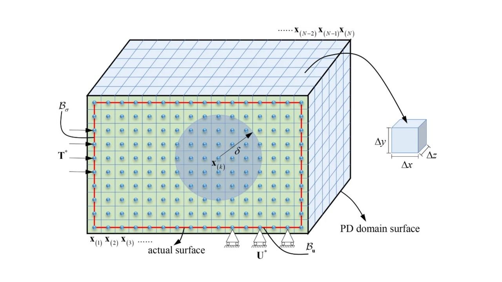

# **PyPeridynamics - A Peridynamic Formulation of Solid Mechanics**

Final Project for the course, APC 524: Software Engineering for Scientific Computing

Contributors: Parameshwaran Pasupathy

<image: https://doi.org/10.1007/s00366-023-01796-w>

## **Usage**

To run the python code, define problem using global_variables.py and run main.py
To compile the Fortran codes for block in tension and block under transverse loading, compile code with makefile using the command, make PROG=Filename. 
To clean up the executables, run make clean.

## **Documentation**

'nox -s docs'

HTML documentation can be found in _build/html/index.html.
